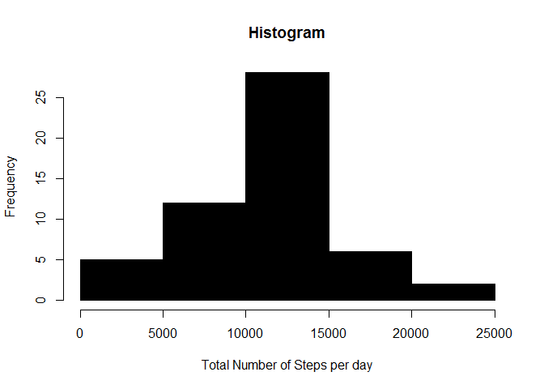
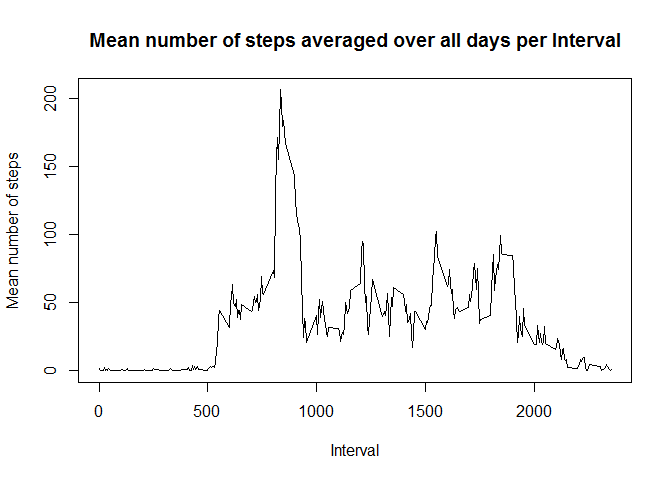
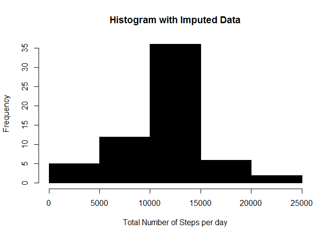

# Reproducible Research: Peer Assessment 1


## Loading and preprocessing the data

```r
library(ggplot2)
library(dplyr)

## File location to be in <working directory>/data/xyz.zip
### and unzipped file at <working directory>/data/xyz.csv
### The below code checks if the file already exists or not, otherwise downloads and unzips the file
# check for directory for data
if(!file.exists("./data")){dir.create("./data")}
# allocating the URL
fileURL <- "https://d396qusza40orc.cloudfront.net/repdata%2Fdata%2Factivity.zip"
# download file

# setting working directory to data
setwd("./data/")

# check if csv file exists and if not then create the file
if(!(file.exists("activity.csv")))
{
  # check if zip file exists and if not, then download the file
  if(!(file.exists("repdata-data-activity.zip")))
  {
    download.file(fileURL, destfile="repdata-data-activity.zip")
  }
  # unzip the zip file
  unzip("repdata-data-activity.zip")
}

# setting the working directory to one level up
setwd("../")

# create data frame from CSV
activityData <- read.csv("./data/activity.csv", header = TRUE, stringsAsFactors = FALSE)
# transforming the date column into class "Date"
activityData$date <- as.Date(activityData$date, format="%Y-%m-%d")
```
## What is mean total number of steps taken per day?

```r
# create data frame with complete cases i.e. only cases without any NA values
activityDataWithoutNA <- activityData[complete.cases(activityData),]

# create data frame aggregating on date
aggregatedActivityDataOnDate <- aggregate(x = activityDataWithoutNA[c("steps")], 
                                             FUN = sum,
                                             by = list(Group.date = activityDataWithoutNA$date))

# plotting histogram of number of steps per day
hist(aggregatedActivityDataOnDate$steps, col = 1, main = "Histogram",
      xlab = "Total Number of Steps per day")
```

\

```r
# determining mean of number of steps per day
meanStepsPerDay <- mean(aggregatedActivityDataOnDate$steps)
meanStepsPerDay
```

```
## [1] 10766.19
```

```r
# determining median of number of steps per day
medianStepsPerDay <- median(aggregatedActivityDataOnDate$steps)
medianStepsPerDay
```

```
## [1] 10765
```
## What is the average daily activity pattern?

```r
# create data frame aggregating on interval
meanActivityDataOnInterval <- aggregate(x = activityDataWithoutNA[c("steps")], 
                                          FUN = mean,
                                          by = list(Group.interval = activityDataWithoutNA$interval))


# plotting time series of type l
plot(meanActivityDataOnInterval$Group.interval, meanActivityDataOnInterval$steps, 
     type='l', col=1, 
     main="Mean number of steps averaged over all days per Interval", xlab="Interval", 
     ylab="Mean number of steps")
```

\

```r
# finding interval with maximum number of steps
maxSteps <- which.max(meanActivityDataOnInterval$steps)

maxStepsInterval <- meanActivityDataOnInterval[maxSteps,]
maxStepsInterval
```

```
##     Group.interval    steps
## 104            835 206.1698
```
## Imputing missing values

```r
## Dataset with NAs
activityDataWithNA <- activityData[!complete.cases(activityData),]
# number of rows with NA values
nrow(activityDataWithNA)
```

```
## [1] 2304
```

```r
# create a copy of the dataset
activityDataAllFilled <- activityData

# looping across the complete dataset
# for rows where data is NA, we first find the mean value of steps for the particular interval
# from the already created dataset and then assign the value in this new dataset to make
# this complete
for (i in 1:nrow(activityDataAllFilled)){
  if (is.na(activityDataAllFilled$steps[i])) {
    intervalValue <- activityDataAllFilled$interval[i]
    id = which(meanActivityDataOnInterval$Group.interval == intervalValue)
    stepsValue <- meanActivityDataOnInterval$step[id]
    activityDataAllFilled$steps[i] <- stepsValue
    
  }
}

aggregatedActivityDataOnDateAllFilled <- aggregate(x = activityDataAllFilled[c("steps")], 
                                          FUN = sum,
                                          by = list(Group.date = activityDataAllFilled$date))

# plotting histogram of number of steps per day
hist(aggregatedActivityDataOnDateAllFilled$steps, col = 1, main = "Histogram with Imputed Data",
     xlab = "Total Number of Steps per day")
```

\

```r
# determining mean of number of steps per day
meanStepsPerDayAllFilled <- mean(aggregatedActivityDataOnDateAllFilled$steps)
meanStepsPerDayAllFilled
```

```
## [1] 10766.19
```

```r
meanStepsPerDay
```

```
## [1] 10766.19
```

```r
# determining median of number of steps per day
medianStepsPerDayAllFilled <- median(aggregatedActivityDataOnDateAllFilled$steps)
medianStepsPerDayAllFilled
```

```
## [1] 10766.19
```

```r
medianStepsPerDay
```

```
## [1] 10765
```
## Are there differences in activity patterns between weekdays and weekends?

```r
for (i in 1:nrow(activityDataAllFilled)){
  if(weekdays(activityDataAllFilled$date[i]) == "Saturday" ||
     weekdays(activityDataAllFilled$date[i]) == "Sunday") {
    activityDataAllFilled$day_type[i] <- "weekend"
  } else {
    activityDataAllFilled$day_type[i] <- "weekday"
  }
}

activityDataAllFilled$day_type <- as.factor(activityDataAllFilled$day_type)

aggDataAllFilledByIntervalAndDayType <- aggregate(x = activityDataAllFilled[c("steps")], 
                                                   FUN = mean,
                                                   by = list(Group.interval = activityDataAllFilled$interval, 
                                                             Group.dayType = activityDataAllFilled$day_type))


qplot(Group.interval, steps, data=aggDataAllFilledByIntervalAndDayType, geom=c("line"), xlab="Interval", 
      ylab="Number of steps", main="") + facet_wrap(~ Group.dayType, ncol=1)
```

\

```r
# clear memory
rm(activityDataAllFilled, activityDataWithNA, activityDataWithoutNA, activityData, aggregatedActivityDataOnDate,
   aggDataAllFilledByIntervalAndDayType, aggregatedActivityDataOnDateAllFilled)
```
